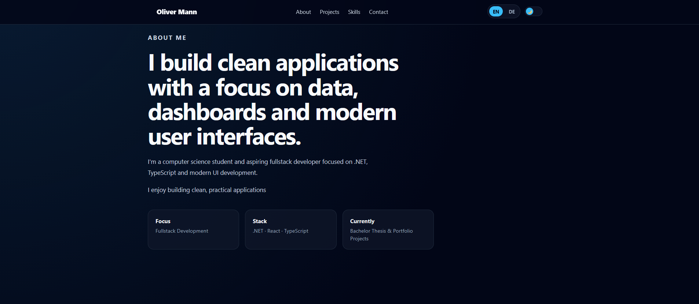
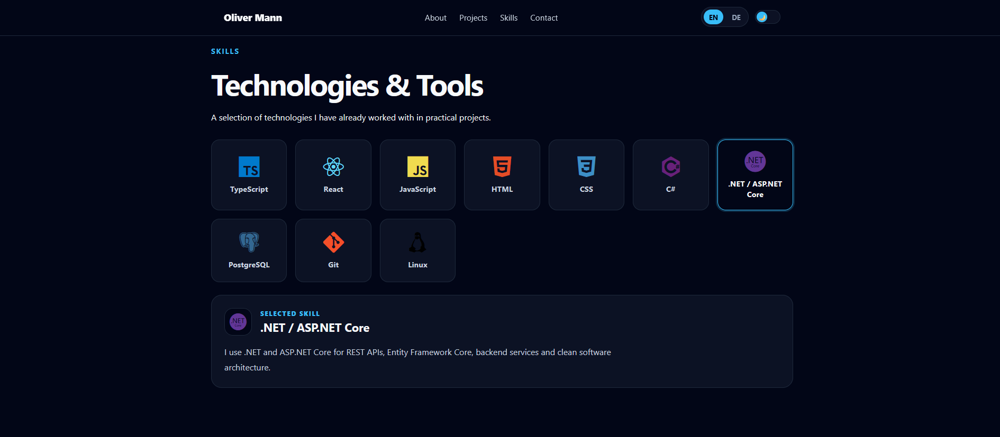
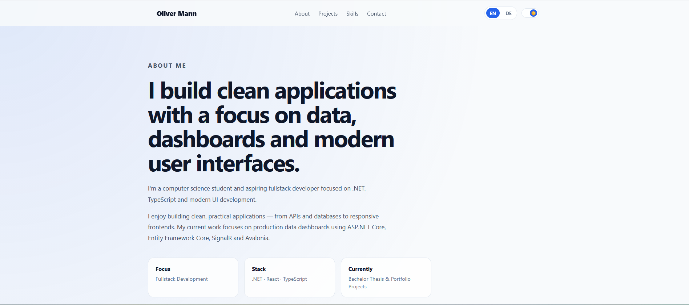
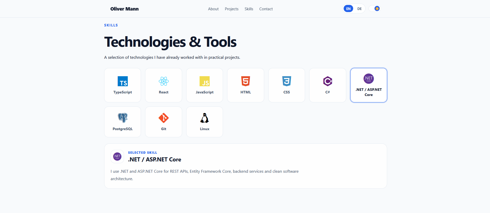

# Developer Portfolio

Personal developer portfolio built with **React**, **TypeScript**, **Vite** and plain **CSS**.

Live version:  
https://dev-portfolio-chi-six.vercel.app

---

## Preview

### Dark Mode




### Light Mode




---

## Features

- Responsive layout
- German and English language switch
- Dark and light mode
- Multiple color themes
- Project and skills sections
- CV download
- React Router navigation

---

## Tech Stack

- React
- TypeScript
- Vite
- CSS
- React Router
- Vercel

---

## Getting Started

```bash
git clone https://github.com/omann-dev/DevPortfolio.git
cd DevPortfolio/portfolio
npm install
npm run dev
```

---

## Build

```bash
npm run build
```

---

## Author

**Oliver Mann**

GitHub: https://github.com/omann-dev  
Portfolio: https://dev-portfolio-chi-six.vercel.app